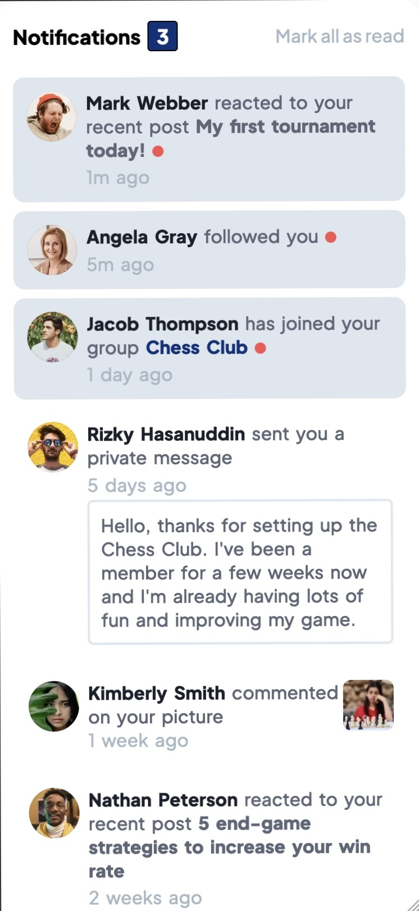

# Frontend Mentor - Notifications page solution

This is a solution to the [Notifications page challenge on Frontend Mentor](https://www.frontendmentor.io/challenges/notifications-page-DqK5QAmKbC). Frontend Mentor challenges help you improve your coding skills by building realistic projects. 

## Table of contents

- [Overview](#overview)
  - [The challenge](#the-challenge)
  - [Screenshot](#screenshot)
  - [Links](#links)
- [Author](#author)

## Overview

### The challenge

Users should be able to:

- Distinguish between "unread" and "read" notifications
- Select "Mark all as read" to toggle the visual state of the unread notifications and set the number of unread messages to zero
- View the optimal layout for the interface depending on their device's screen size
- See hover and focus states for all interactive elements on the page

### Screenshot

This shows the Desktop view of the application

This shows the Mobile view of the application

### Links

- Solution URL: [FrontEnd Mentor](https://www.frontendmentor.io/solutions/responsive-notification-tag-with-js-to-mark-notifications-as-read-kSCmFXJWOC)
- Live Site URL: [Notification Page](https://harshita-vyass.github.io/notifications-page-main/)

## Built with

- Semantic HTML5 markup
- CSS custom properties
- Flexbox
- Vanila JS

## Author

- Website - [Harshita Vyas](https://harshita-vyass.github.io/portfolio/)
- Frontend Mentor - [@harshita-vyass](https://www.frontendmentor.io/profile/harshita-vyass)

